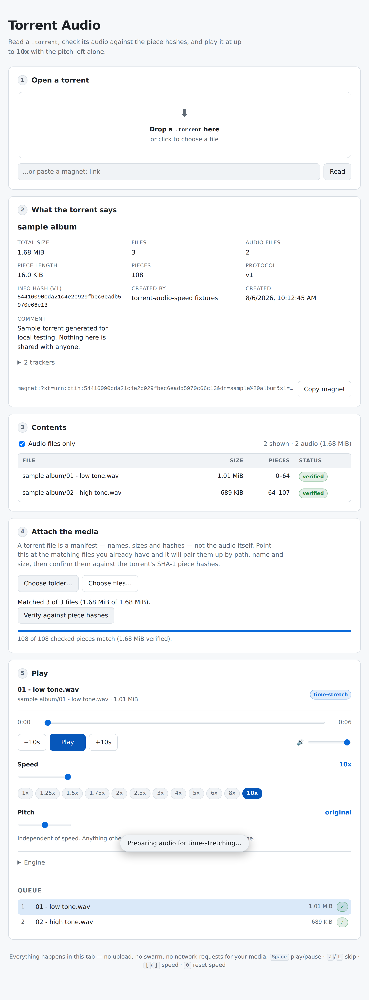

# Torrent Audio

Read a `.torrent`, check its audio against the torrent's own piece hashes, and play it at up to
**10x** with the pitch left alone — at any file size, including gigabyte-plus tracks.

No dependencies, no build step, no framework. `npm start` and open the page.



---

## What this actually does

A `.torrent` file is a **manifest** — names, sizes, tracker URLs and SHA-1 hashes of every piece of
content. It does not contain the audio. So "an app that reads torrent files and plays their audio at
10x" is really two halves that need a bridge, and this is the bridge it uses:

1. **Read** the `.torrent` — full bencode parse, correct info hash, file layout, piece map.
2. **Pair** its entries with audio files you already have on disk, by path, then name, then size.
3. **Verify** those files against the torrent's piece hashes, so you know they are bit-for-bit the
   content the torrent describes — including which files are incomplete or corrupt, and by how much.
4. **Play** the verified audio at 0.25x–10x, with pitch preserved and independently adjustable.

Step 3 is what makes reading the torrent load-bearing rather than decorative. It is a real integrity
check, the same one a BitTorrent client runs.

**It does not download from the swarm.** There is no peer wire protocol, no DHT, no tracker traffic —
the app never makes a network request for your media, and nothing leaves the tab. See
[Adding a download backend](#adding-a-download-backend) if you want that half.

## Quick start

```sh
npm start            # http://127.0.0.1:8080
```

Nothing to install. Serve it over `http://localhost` rather than opening the file directly — the app
needs a secure context for `crypto.subtle` (info hashes, piece verification) and `AudioWorklet`.

To try it without hunting for files, generate a sample torrent and the audio it describes:

```sh
npm run fixtures     # writes ./fixtures
```

Then open `fixtures/sample album.torrent`, click **Choose folder…**, pick `fixtures/sample album`,
and hit **Verify**. All 108 pieces should come back clean.

## Getting to 10x

This is the part that needs real work, because the obvious approach does not get there.

The cheap way to speed audio up in a browser is `audio.playbackRate` with `preservesPitch`. It
streams straight off disk and sounds good — but browsers only reliably honour a modest range, and
past it they clamp the rate or mute the output altogether. You cannot depend on 10x from it.

The alternative is to do the time-stretching yourself, which is what
[`public/lib/wsola-core.js`](public/lib/wsola-core.js) implements: **WSOLA**, waveform-similarity
overlap-add.

> Cut the signal into overlapping Hann-windowed frames, then overlap-add them back together at a
> *different* hop than they were taken from. Output hop `Hs` stays fixed; analysis hop
> `Ha = Hs × speed`. Playing 10x faster means stepping 10x further through the input per frame while
> emitting the same number of samples — the waveform's period never changes, so the pitch never
> changes.
>
> Naive overlap-add at that ratio produces phasey, warbling artefacts. The "waveform similarity" part
> is the fix: before laying each frame down, search ±256 samples around the ideal position for the
> offset whose waveform best correlates (normalised cross-correlation) with the tail already
> committed, so successive frames stay in phase. The ideal pointer advances by `Ha` regardless of the
> offset chosen, so those corrections never accumulate into drift.

Pitch rides on the same machinery: to shift pitch by ratio `p` while holding speed `s`, stretch by
`s/p` and resample by `p`. Resampling scales duration by `1/p`, so the two compose back to exactly
`s` — speed and pitch become genuinely independent controls.

The stretcher runs in an `AudioWorklet`, on the audio thread, so it never glitches from main-thread
work.

### Large files

The stretcher never holds the track. Each synthesis step only touches
`[position - searchRadius, position + searchRadius + frameSize)` — under 60ms of audio — so the
worklet works over a **sliding 30-second window** that the main thread keeps topping up ahead of the
playhead. Whole-file playback is just the degenerate case of a window covering everything.

That makes playback cost a function of the window, not the file. Measured on a real **1.07 GB**
WAV (101 minutes) in Chromium:

| | growth over an idle tab |
|---|---|
| Verifying all 1025 pieces | **+41 MB** (110 MB/s) |
| Playing it at 10x | **+50 MB** |
| First audio after pressing play | **0.36 s** |
| Seeking 95 minutes in | **instant** |

The same run on a 16x smaller file costs +40 MB and +13 MB — flat, as the design intends. Decoding
that track whole would have needed roughly 2 GB of PCM before it could play a single sample.

Two things make this possible, and they apply to different formats:

- **Uncompressed audio (WAV) is exactly addressable.** Frame N lives at a known byte offset, so any
  window is read straight off disk without touching anything before it. File size is irrelevant.
- **Compressed audio is not.** `decodeAudioData` is all-or-nothing — there is no way to ask for "just
  the audio between 40 and 70 seconds" without a container demuxer — so those formats are decoded
  whole and capped by a memory budget (default 1 GB of PCM, about 45 minutes of stereo). Past that,
  the native engine still streams the file at any size, and the UI disables the unreachable presets
  and explains why rather than letting them silently do nothing.

Verification streams at every size too, and reads through a block cache: torrents often use 16-64 KB
pieces, so a gigabyte is tens of thousands of pieces, and slicing the file once per piece turns into
tens of thousands of round trips. Pulling 4 MB at a time and serving pieces out of that cuts a
32-piece verification from 32 reads to 2.

### Two engines, picked automatically

| | `native` | `wsola` |
|---|---|---|
| Mechanism | `playbackRate` + `preservesPitch` | our AudioWorklet |
| Memory | streams, negligible | a 30s window (WAV) or the decoded track (compressed) |
| Speed range | whatever the browser honours (probed at startup, capped at 4x) | 0.25x–10x, guaranteed |
| Pitch control | none | ±12 semitones, independent |

**Auto** uses `native` while it is safely in range and switches to `wsola` above it, or the moment
pitch is shifted. Switching carries the playback position across, so it is inaudible apart from the
decode pause the first time. You can force either engine under **Engine**.

`native` stays the default at ordinary speeds because it costs nothing at all — no decode, no window
pump. The UI states what the time-stretching engine will need for the loaded track before you reach
for it.

## Layout

```
server.js                        static server, no deps
public/
  index.html  styles.css  app.js UI and wiring
  lib/
    bencode.js                   decoder/encoder, tracks raw byte spans
    torrent.js                   v1 + v2 + hybrid parsing, magnet URIs, piece map
    verify.js                    SHA-1 piece verification -> per-file verdicts
    matcher.js                   torrent entries <-> local files
    player.js                    two-engine player, engine switching, window pump
    sources/
      index.js                   picks a reading strategy per file
      wav.js                     streaming reader: exact byte-range access, any size
      decoded.js                 whole-file decode, memory-budgeted
    wsola-core.js                the DSP (classic script — see below)
    hash.js  format.js  media.js
  worklets/
    stretch-processor.js         AudioWorkletProcessor around the DSP
test/                            unit tests + fixture generator
scripts/e2e.mjs                  browser end-to-end check
```

Two implementation notes worth knowing before editing:

- **`bencode.js` records the byte span of every dictionary value.** The info hash must be SHA-1 over
  the *original* bytes of the `info` dictionary. Re-encoding the parsed value and hashing that gives
  the wrong hash for any torrent whose encoding is not perfectly canonical, and plenty of real ones
  are not.
- **`wsola-core.js` is a classic script, not a module.** `player.js` fetches it and
  `stretch-processor.js`, concatenates them, and hands the result to `addModule` as a blob, because
  worklet modules with static `import` are not dependably supported. That keeps one copy of the DSP
  shared between the worklet and the tests.

## Tests

```sh
npm test                 # 92 unit tests, no dependencies
npm run test:e2e         # drives the real app in Chromium (needs playwright; skips if absent)
npm run test:e2e:large   # generates a 1GB file and measures memory while playing it
```

The unit tests cover bencode round-tripping and malformed input, info-hash correctness against
independently computed SHA-1, v1/v2/hybrid parsing, piece mapping, pad files, magnet round-trips,
file matching, and piece verification — including that a single flipped byte is caught, and that a
failure in a piece two files share is reported as a boundary problem rather than blamed on one of
them.

The DSP is tested on its output, not its internals: output length tracks the requested speed to
within one hop, and **zero-crossing rate stays within 10% of the original at 1x, 2x, 5x and 10x** —
that is the pitch-preservation claim, measured.

Windowed streaming is held to a strict standard: playing a track window by window must produce
**bit-identical output** to holding it all in memory, at 1x, 4x and 10x. A listener cannot tell which
path ran.

The e2e checks walk the whole flow in a real browser and time it: a 6-second track at 10x completes
in **~0.66 s**, and the large-file run reports browser memory stage by stage, read from `/proc` as
PSS so shared pages between Chromium's processes are not counted more than once.

## Limitations

- **No swarm.** Reads torrents, does not download them.
- **Format support is the browser's.** Formats it cannot decode (APE, WMA, DSF…) are still listed and
  verified, and flagged in the UI rather than failing silently.
- **Only uncompressed audio streams.** WAV time-stretches at any size; compressed formats are
  decoded whole and capped at roughly 45 minutes of stereo. A frame-indexed MP3 or FLAC reader would
  lift that — see below.
- **10x is intelligible, not transparent.** No time-stretcher is artefact-free that far out. The
  **smoothing window** control trades smoothness on music against crispness on speech.
- **Verification needs v1 piece hashes.** Pure-v2 torrents parse and list fine, but v2 uses merkle
  trees rather than a flat piece list, which this does not yet check against.

## Extending it

Both open seams take the same shape: implement an interface, change nothing else.

**More streaming formats.** Sources expose
`{ streaming, sampleRate, channels, totalFrames, duration, readFrames(start, count), close() }`, and
`createAudioSource` picks between them. A frame-indexed MP3 or FLAC reader implementing that would
give those formats the same unlimited-size playback WAV gets, without the player, the stretcher or
the worklet changing at all. Two diagnostics help when working on this: `?noStream=1` forces the
whole-file decode path, and `?decodeBudgetMB=N` shrinks the budget so the fallback behaviour is easy
to trigger.

## Adding a download backend

The app takes its media from a `Map<torrentFileIndex, Blob>` (`state.sources` in `app.js`), and
nothing downstream — matching, verification, the player — knows or cares where those blobs came from.
A fetching backend only has to populate that map. A WebTorrent-style WebRTC client, a webseed
(BEP 19) fetcher over the `url-list` this parser already reads, or a local client's API would each
drop in at that seam without touching the parser, the verifier or the DSP.
